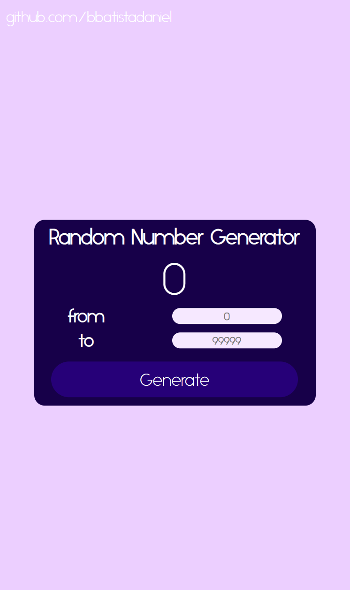

# Random Number Generator

Random Number Generator is a web application designed to generate random numbers within a specified range. It includes a user-friendly interface built with HTML, styled using CSS, and utilizes JavaScript for dynamic functionality.

## Features

- **User-Friendly Interface:** The application offers a clean and straightforward interface for generating random numbers.

- **Random Number Generation:** Input a range, click the "Generate" button, and the application will display a random number within the specified range.

## How to Use

1. **Enter Range:** Input the minimum and maximum values into the designated input fields.

2. **Generate Random Number:** Click the "Generate" button to generate a random number within the specified range.

## Project Structure

- **HTML (index.html):** Defines the structure of the web page.

- **CSS (style.css):** Styles the HTML elements for a visually appealing interface.

- **JavaScript (script.js):** Implements the logic for generating random numbers and handling user interactions.

## Requirements

- Web browser

## Usage

1. Clone or download the repository to your local machine.

2. Open the `index.html` file in a web browser.

## Screenshots

## License

This project is open-source and is available under the [MIT License](LICENSE). Feel free to use and modify the code as needed.

## Testing

To experience this project, you can visit the following link: [Random Number Generator](https://bbatistadaniel.github.io/RandomNumberGenerator)
